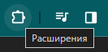
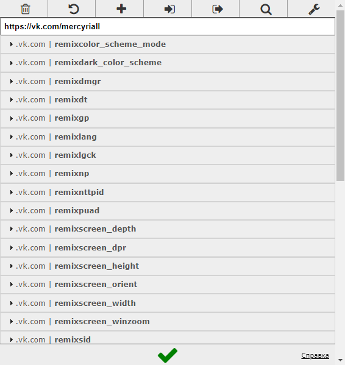
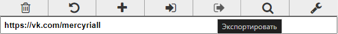
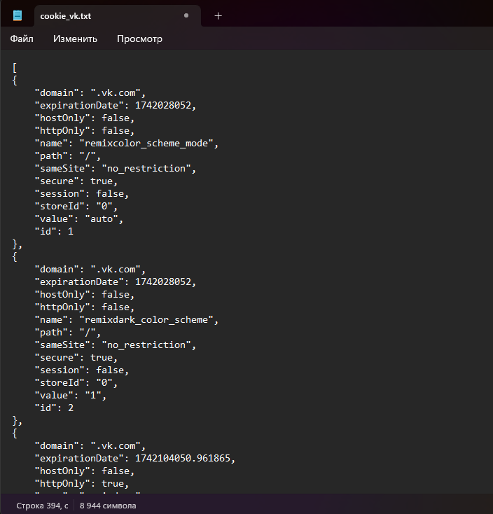
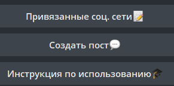
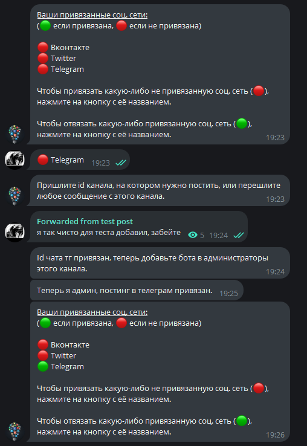
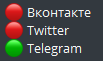

# 
Distribution bot

 

## <a name="Доступные-соц-сети">Доступные соц. сети</a>
 - [X] __[vk](https://vk.com)__
   - [X] _группа_
   - [X] _профиль_
 - [ ] __[~~instagram~~](https://www.instagram.com)__
 - [X] __[telegram](https://web.telegram.org/a/)__
 - [X] __[twitter](https://twitter.com)__
   - [ ] ~~группа~~
   - [X] профиль
 - [ ] __[~~yandex zen~~](https://dzen.ru)__
---

> __Telegram-bot: [@DistributionBot](https://t.me/TgInstVK_bot)__

---
 ## Начало работы

- __Предоставить боту cookie аккаунтов от соц. сетей, которые вас интересуют__
  - [_инструкция извлечения cookie_](#извлечение-cookie)
  - [_инструкция передачи cookie боту_](#передача-cookie)
  - [_дополнительно_](#дополнительно)
- Написать пост соответствуя указанным ограничениям ( выставляются соц. сетью )
  - длина текста
  - количество изображений
  - разрешение изображения

---
## Инструкции
### <a name="извлечение-cookie">__Извлечение cookie__</a>
1) Установить расширение [EditThisCookie](https://chromewebstore.google.com/detail/editthiscookie/fngmhnnpilhplaeedifhccceomclgfbg?hl=ru) для вашего браузера
2) Создаем текстовый файл формата _.txt_ на компьютере, для удобства рекомендуем называть его в соответствии с соц. сетью ( _cookie_vk.txt_, _cookie_tw.txt_ ), но можно и любым другим образом.
3) Входим в аккаунт соц. сети ( [доступные](#доступные-соц-сети) )
4) Находясь в аккаунте ищем кнопку с имеющимися расширениями

    
5) Открываем EditThisCookie

    
> __Находясь в _ВК_ у вас должны быть похожие поля__
6) Нажимаем кнопку 'экспортировать'

    
7) Открываем раннее созданный txt файл и импортируем наши куки ( сочетание клавиш ctrl+v или правая кнопка мыши --> вставить )

    
8) Отправляем файл нашему боту

 ### <a name="передача-cookie">__Передача cookie__</a>
1) Переходим в меню привязанные соц. сети

    
2) Выбираем какую соц. сеть хоти привязать

    
1) Далее следуйте пошаговой инструкции относительно данной соц. сети
    
    
2) - в телеграмме необходимо написать id группы или переслать сообщение, как показанно на скриншоте, затем добавить бота в администраторы канала ( не обязательно перед этим его добавлять )
   - в вк необходимо передать файл с куки, затем указать ссылку на профиль/группу в которую планируете постить
   - для твитера достаточно только файла с куки
2) После прохождения инструкции сразу видно какие соц. сети успешно привязаны

    

   3) Если подключение по куки не успешно
      - Убедиться, что в момент получения куки вы авторизованы в аккаунте
      - Попробовать получить еще раз, обновив страницу и перед получением находиться на страничке своего профиля
      - Проверить целостность отправленного файла

 ### <a name="дополнительно">__Дополнительно__</a>
- Для vk кроме cookie небходимо передать ссылку на страницу, в которой вы хотите сделать пост ( это может быть группа или страница профиля ). Это сделанно для того, чтобы вы могли определить место размещения поста.
 
  
